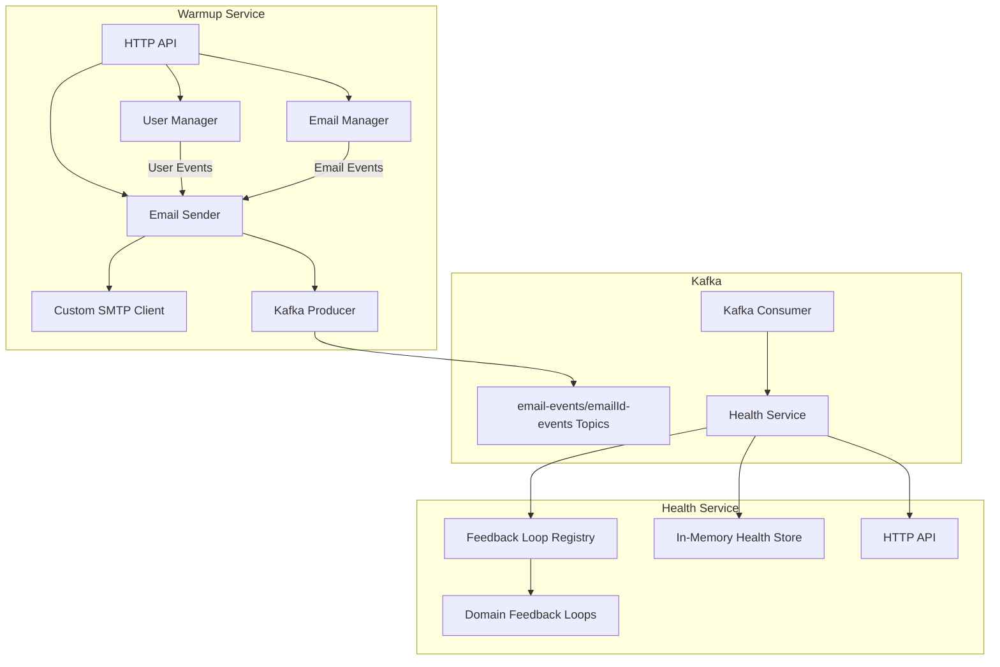

# Enterprise Email Warmup & Health Tracking System

---

## Intution

- There are 2 main tasks. Send bulk emails to users and track those emails for spam, delivered, open etc task.
- Email warmup service will handle user registration, sending and managing emails.
- It should be able to send new emails to all users using bulk approach and also send all previous emails to a new registered without violating there rate limits.
- It should be able to send emails via multiple smtp clients as preferred by organization.
- Also, new smtp clients should be easily configurable.
- Now, email health service takes care of email health and gather stats such as delivered, marked spam, opened or read from various email domains.
- Email health service interacts with email warmup service using kafka which serves as medium to send unique message_id for each email for health service to track.
- Email health service should check health stats at some constant interval for all emails which are added through Feedback loops of various domains. Also it should support new email additions to the same worker.
- Addition of new domain feedback loops should be easy.
- Both services should have REST endpoints for clients.


---

## Overview
This project provides an enterprise-grade solution for email warmup and health tracking, designed for high deliverability and robust monitoring. It consists of two main Go microservices:

- **Email Warmup Service**: Handles user registration, custom SMTP email sending, broadcasting, and Kafka event production.
- **Email Health Service**: Tracks delivery, spam, open/read status per email, consumes Kafka events, and provides domain-specific feedback loops.

All SMTP logic is custom (no third-party email APIs), and the system is designed for extensibility and production use.

---

## Architecture



---

## Service Responsibilities

### Email Warmup Service
- Register users and manage user list
- Broadcast emails to all users (with custom SMTP)
- When a new user joins, send all previous emails to them (rate-limited)
- Produce events to Kafka for every email sent
- Expose HTTP API for registration, sending, and listing

### Email Health Service
- Consume email events from Kafka
- Maintain a set of known domains (from emailId-events)
- Track delivery, spam, open/read status per email (mocked feedback for now)
- Provide per-domain feedback loop extensibility
- Expose HTTP API for querying health status and stats

---

## Environment & Deployment

- **Environment Variables** (see `docker-compose.yml`):
  - `PORT`: Service port
  - `KAFKA_BROKERS`: Kafka broker addresses
  - `KAFKA_TOPIC`: Kafka topics (comma-separated)
  - `GMAIL_SMTP_USERNAME`, `GMAIL_SMTP_APP_PASSWORD`: SMTP credentials (warmup service)
  - `CHOOSEN_SMTP_CLIENT_TYPE`: SMTP client type (e.g., GOOGLE, MAILPIT)

- **Docker Compose**: Orchestrates Kafka, warmup, and health services for local development.

- Use `make all` to start all services and Kafka
- Services are available at `localhost:8080` (warmup) and `localhost:8081` (health)

---

## API Endpoints

### Email Warmup Service (default: `:8080`)

| Method | Endpoint      | Description                |
|--------|--------------|----------------------------|
| POST   | /register     | Register a new user        |
| POST   | /send         | Broadcast email to users   |
| GET    | /users        | List all registered users  |
| GET    | /emails       | List all sent emails       |
| GET    | /emailIds     | List all user email IDs    |

#### Example: Register User
```http
POST /register
Content-Type: application/json
{
  "name": "Alice",
  "email_id": "alice@example.com"
}
```

#### Example: Send Email
```http
POST /send
Content-Type: application/json
{
  "from": "noreply@yourdomain.com",
  "subject": "Welcome!",
  "body": "Hello, welcome to our warmup system."
}
```
Response:
```json
{
  "message_id": "<email-123@gmail.com>"
}
```

#### Example: List Users
```http
GET /users
```
Response:
```json
[
  { "name": "Alice", "email_id": "alice@example.com", "created_at": "..." },
  ...
]
```

---

### Email Health Service (default: `:8081`)

| Method | Endpoint         | Description                        |
|--------|------------------|------------------------------------|
| GET    | /mail_stats      | Get health status by email ID (query param: `email_id`) |
| GET    | /all_mail_stats  | List all email health statuses     |

#### Example: Get Health Status
```http
GET /mail_stats?mail_id="message_id_from_send_email"
```
Response:
```json
{
  "email_id": 123,
  "delivered": 10,
  "spam": 0,
  "opened": 8,
  "read": 7,
  "checked_at": "..."
}
```

#### Example: List All Health Statuses
```http
GET /all_mail_stats
```
Response:
```json
{
  "123": { "email_id": 123, ... },
  "124": { "email_id": 124, ... }
}
```

---

## Kafka Eventing
- **Topics**: `email-events` (broadcasts), `emailId-events` (per-user sends)
- **Producer**: Warmup service sends events for every email
- **Consumer**: Health service consumes and updates health status

---

## Feedback Loops & Extensibility
- Each domain (Gmail, Yahoo, etc.) has its own feedback loop implementation
- Registry pattern allows easy addition of new domains
- Feedback loops are currently mocked (simulate delivery/spam/open/read)
- Ready for real IMAP/POP3/API integration in production

---

## Extending the System
- **Add new feedback loops**: Implement the `FeedbackLoop` interface and register in the health service
- **Integrate real feedback**: Replace mocked logic with IMAP/POP3 polling or ARF parsing
- **Persistent storage**: Swap in-memory maps for a database for production
- **Add more SMTP providers**: Implement the `SmtpClient` interface for new providers

---
